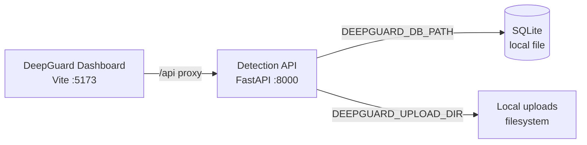

# Azure Debug Plan

> This plan is the source of truth for generating the
> VS Code debug setup in this workspace.
>
> **Status:** Approved
> **Execution Mode:** Guided
> **Created:** 2026-09-21T00:00:00Z
> **Last Updated:** 2026-09-21T00:00:00Z
>
> <!-- Guided Mode (default) - hand-holds the user through review and approval before generating. -->

## Prerequisites

| Tool / Extension | Category | Service(s) | Installed | Version |
|------------------|----------|------------|-----------|---------|
| Python | Runtime | `backend` | ✅ | 3.14.4 |
| pip | Package manager | `backend` | ✅ | 26.1.2 |
| Node.js | Runtime | `frontend` | ✅ | 24.15.0 |
| npm | Package manager | `frontend` | ✅ | 11.12.1 |
| SQLite | Runtime / database CLI | `backend` | ❓ | Python `sqlite3` module is the fallback |
| Docker | Container runtime | `backend`, `frontend` | ❓ | Not found on PATH |
| Docker Compose | Orchestrator | `backend`, `frontend` | ❓ | Not found on PATH |
| Python extension (`ms-python.python`) | VS Code debug extension | `backend` | ✅ | 2026.4.0 |
| ESLint extension (`dbaeumer.vscode-eslint`) | VS Code debug extension | `frontend` | ❓ | Not confirmed; no ESLint dependency detected |
| Docker extension (`ms-azuretools.vscode-docker`) | VS Code container integration | `backend`, `frontend` | ❓ | Not confirmed |

> ⚠️ **Action required:** Confirm any tool or extension marked ❓ is installed and ready before approving this plan. Docker or Podman is required only for the existing Compose workflow; the services can also be debugged directly with Python and npm.

## Debug Configurations

| Generate | Debug Config Name | Service Label | Service Root | Project Type | Runtime | Version | Azure Dependencies |
|----------|--------------------|---------------|--------------|--------------|---------|---------|---------------------|
| [x] | DeepGuard Detection API (debug) | Detection API | `./backend` | app-service | python | 3.14 | — |
| [x] | DeepGuard Dashboard (debug) | DeepGuard Dashboard | `./frontend` | frontend-spa | node-ts | 24.15 | — |
| [x] | Debug All Services | Debug All Services |  | *Compound Config* |  |  |  |

Project Type Descriptions

| Project Type | Description |
|-------------|-------------|
| app-service | HTTP server application launched with Uvicorn and FastAPI. |
| frontend-spa | Single-page application served by the Vite development server. |

> ℹ️ **Proxy detected:** The dashboard proxies `/api` requests to the Detection API at `http://127.0.0.1:8000` via `frontend/vite.config.ts`. The compound configuration should start the backend before the frontend.

## Orchestrator

| Orchestrator | Container Runtime | Compose Command | Description |
|-------------|-------------------|-----------------|-------------|
| Docker Compose | Docker | `docker compose` | Uses the existing `docker-compose.yml` to run the backend and frontend together. Docker was not confirmed on PATH during the scan; install or start a compatible container runtime before using this workflow. |

## Emulators

No Azure service dependencies were detected. SQLite and the local filesystem are essential local services and are provided directly by the backend process, so no emulator container is required.

## Architecture Diagram

During debugging, the Vite dashboard sends `/api` requests through its local proxy to the FastAPI service, which persists analysis metadata in SQLite and uploaded media on the local filesystem.

## Migrations

When selected, the generation phase creates an automated VS Code task that runs the existing raw SQL migration before the backend starts debugging.

| Generate | Service | Migration Tool |
|----------|---------|----------------|
| [x] | Detection API | Raw SQL (`backend/migrations/*.sql`) |

## API Test Collections

When selected, the generation phase produces a lightweight runnable API smoke-test script for the local HTTP endpoints.

| Generate | Service | Description |
|----------|---------|-------------|
| [x] | Detection API | 

HTTP Endpoints (6)
 GET /api/health GET /api/version POST /api/analyze/text POST /api/analyze/media GET /api/analyses GET /api/analyses/{analysis_id}  
 |

## Convenience Scripts

| Generate | Script | Registered In | Description |
|----------|--------|---------------|-------------|
| [x] | backend:dev | `./package.json` | Start the FastAPI backend with Uvicorn on port 8000. |
| [x] | frontend:dev | `./package.json` | Start the Vite dashboard on port 5173. |
| [x] | test:backend | `./package.json` | Run the backend pytest suite. |
| [x] | test:frontend | `./package.json` | Run the frontend Vitest suite. |
| [x] | debug:compose | `./package.json` | Start the existing Docker Compose stack when a container runtime is available. |

## Debug Configuration Checklist

Debug Configuration Checklist:
✅ DeepGuard Detection API (debug) — ready signal observed; GET /api/health returned HTTP 200 and backend pytest suite passed (2 passed)
✅ DeepGuard Dashboard (debug) — Vite dev server reached HTTP 200 on http://127.0.0.1:5173
✅ Debug All Services — backend and frontend were started in sequence and both services responded successfully on their local ports